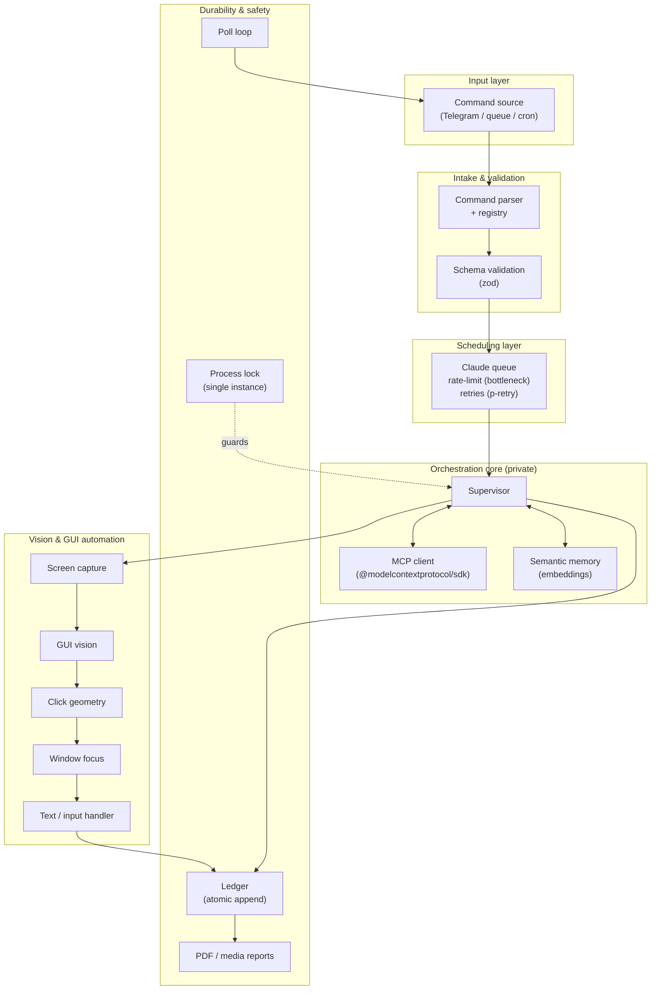

# Architecture

> Design-level overview of the multi-agent desktop orchestrator. This document describes **how the system is structured and how data flows through it** — enough to evaluate the engineering, without disclosing the proprietary orchestration logic at the core (intentionally not published).

---

## 1. The problem

Driving an LLM-powered agent that operates a **real desktop** — reading the screen, clicking, typing, switching windows — is mostly a *reliability* problem, not an AI problem. A naive script breaks the moment a model rate-limits, a window loses focus, a click lands a few pixels off after a resolution change, or two runs of the same process race on the same machine.

This system is built around that reality: a Node.js orchestration layer that turns natural-language commands into **safe, idempotent, observable desktop actions**, with the LLM calls themselves treated as an unreliable network dependency to be queued, throttled, retried, and validated.

---

## 2. High-level data flow

A command travels through a small number of well-separated stages. Each stage has one job and hands a validated payload to the next.

**Reading the flow:**

1. **Input** — a command arrives from a channel (e.g. Telegram), the internal task queue, or a scheduled `node-cron` job.
2. **Intake** — the parser maps it against a command **registry** and the payload is validated with **zod** before anything else runs. Unrecognized or malformed input is rejected here, not three stages later.
3. **Scheduling** — valid tasks enter a queue that **rate-limits** outbound LLM calls and **retries with backoff** on transient failures. The model is treated as a flaky remote dependency.
4. **Orchestration (private core)** — the supervisor decides what to do, calling tools over **MCP** and consulting **semantic memory** for relevant prior context. *This decision logic is the part not published.*
5. **Actuation** — chosen actions are executed against the live desktop: capture the screen → locate targets via GUI vision → translate to resolution-correct coordinates → focus the right window → click/type.
6. **Durability** — every meaningful step is appended to an **atomic ledger**; a **single-instance lock** prevents concurrent runs; a poll loop keeps the system live; reports can be rendered to PDF/media.

---

## 3. The 15 core modules (one line each)

The orchestration core lives in `core/`. Each module is a single, testable responsibility:

| Module | Responsibility |
|---|---|
| `agc_ledger` | Append-only, atomically-written event log — the system's source of truth for what happened and when. |
| `agc_supervisor` | Top-level orchestrator that sequences a task end to end and reacts to results. |
| `claude_queue` | Task queue in front of the LLM: rate-limiting + retry/backoff so model calls degrade gracefully. |
| `click_geometry` | Translates logical UI targets into resolution-correct pixel coordinates (survives display/DPI changes). |
| `gui_vision` | Locates on-screen elements from captured frames so actions target the right thing. |
| `mcp_client` | Model Context Protocol client — exposes/consumes tools through the MCP SDK. |
| `media_handlers` | Normalizes images/video artifacts (capture, conversion) for downstream processing. |
| `poll` | Long-running poll loop that keeps the agent live and pulls new work. |
| `process_lock` | Single-instance guard — refuses to start a second copy and corrupt shared state. |
| `report_pdf` | Renders run summaries and evidence into shareable PDF reports. |
| `screen_capture` | Grabs the current desktop frame(s) as the input to the vision stage. |
| `semantic_memory` | Embedding-based memory: stores and retrieves relevant context across runs. |
| `text_handler` | Keyboard input / text composition and entry into focused targets. |
| `window_focus` | Brings and verifies the correct window to the foreground before acting. |
| *(intake)* `command_parser` + registry | Parses incoming commands and dispatches them against a known command set. |

> The last row groups the intake-side parsing/registry that feeds the supervisor; it sits at the boundary between the input layer and the core.

---

## 4. Resilience & safety decisions

These are the decisions that make the system safe to point at a real machine. They are deliberate, and each is backed by tests.

- **Single-instance lock (`process_lock`).** Desktop automation shares one mouse, one keyboard, one foreground window. Two concurrent runs would fight over them and corrupt the ledger. The lock makes "exactly one orchestrator" an invariant rather than a hope.

- **Deny-by-default environment (`dotenv-safe`).** The process refuses to boot unless every required secret/config var is present. Misconfiguration fails loudly at startup instead of leaking out as a confusing runtime error mid-task.

- **Atomic writes (`write-file-atomic`).** The ledger and other state files are written atomically, so a crash or kill mid-write never leaves a half-written, unparseable file. Recovery always reads a consistent state.

- **Schema validation everywhere (`zod`).** Inbound commands and tool payloads are validated against explicit schemas at the boundary. Bad data is rejected at intake, keeping the core dealing only with well-formed input.

- **Rate-limit + retry on the LLM (`bottleneck` + `p-retry`).** Model calls are throttled to respect provider limits and retried with backoff on transient failures, so a brief 429 or network blip doesn't abort a whole task.

- **Resolution-robust clicks (`click_geometry`).** Coordinates are computed by ratio against the live display rather than hard-coded, so a resolution or DPI change (e.g. switching to a 1080p remote session) doesn't make every click miss.

---

## 5. MCP integration

The agent speaks the **Model Context Protocol** via `@modelcontextprotocol/sdk` (`mcp_client`). MCP is used as the **tool boundary** between the orchestration core and the capabilities it can invoke: tools are described, discovered, and called through a standard protocol rather than ad-hoc function wiring. This keeps the supervisor decoupled from individual tool implementations and makes the capability set extensible without touching the core decision flow.

---

## 6. Observability

Every run is reconstructable after the fact:

- **Ledger** — atomic, append-only event trail of decisions and actions.
- **Reports** — `report_pdf` + `media_handlers` turn a run (including screenshots) into a self-contained PDF for review.
- **Channel feedback** — status can be surfaced back through the same channel that issued the command (e.g. Telegram).

---

## 7. Tech stack (orchestration layer)

- **Runtime:** Node.js (native `node --test` test runner — **178 tests across 28 files**).
- **LLM / protocol:** `openai`, `@modelcontextprotocol/sdk`.
- **Scheduling & resilience:** `bottleneck`, `p-retry`, `node-cron`, `process_lock`, `dotenv-safe`, `write-file-atomic`, `zod`.
- **Desktop automation:** `robotjs`, `screenshot-desktop`, `sharp`, `fluent-ffmpeg`.
- **I/O & integrations:** `node-telegram-bot-api`, `axios`, `cheerio`, `firebase-admin`, `pdfkit`.

---

## 8. What is — and isn't — in this repository

This is a **showcase repository**. The proprietary orchestration logic at the core (the supervisor's decision-making — the part that took the most work) is intentionally **not published**; it is the project's moat and is walked through live in interviews.

What you can review here: this architecture, the README, and supporting media. The full source — including the test suite — is available to discuss directly.

---

## License

All Rights Reserved — see [`LICENSE`](../LICENSE). Published for portfolio review only.
Contact: **dilandelvallemijangos@gmail.com**
